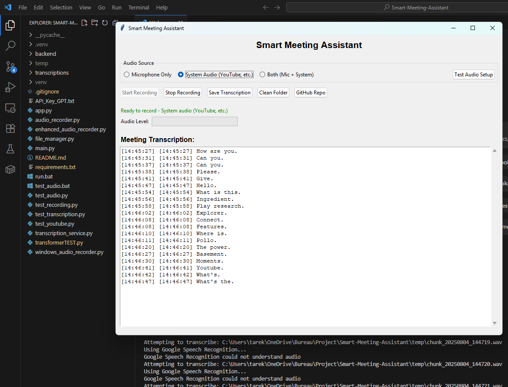

# Smart Meeting Assistant

A comprehensive Python application that records meetings and provides **real-time transcription** with both desktop GUI and system audio recording capabilities.

## Features

###  Audio Recording
- **Microphone recording** - 
- **System audio recording** - Capture any system audio
- **Both simultaneously** - Record microphone + system audio
- **Real-time audio level monitoring** 

###  Live Transcription
- **Real-time speech-to-text** 
- **Google Speech Recognition** 
- **Offline fallback** 
- **Multiple audio sources**

###  User Interface
- ** GUI** - Built with tkinter
- **Audio source selection** 
- **Live transcription display**
- **Audio level visualization** 

###  File Management
- **Save transcriptions** 
- **Automatic cleanup**
- **Organized storage**
##  How to Use
### For YouTube/System Audio Recording:
1. **Launch the app**: `python main.py`
2. **Select "System Audio (YouTube, etc.)"**
3. **Open YouTube** and play any video
4. **Click "Start Recording"**
5. **Watch live transcription** 

### For Microphone Recording:
1. **Select "Microphone Only"**
2. **Click "Start Recording"**
3. **Speak clearly** 
### For Both:
1. **Select "Both (Mic + System)"**
2. **Record conversations while system audio plays**

## File Structure

- `app.py` - Main Streamlit application
- `audio_recorder.py` - Audio recording functionality
- `transcription_service.py` - Speech-to-text processing
- `file_manager.py` - File operations for saving/loading
- `components/` - Streamlit custom components
- `static/` - CSS and JavaScript files
- `temp/` - Temporary audio files (auto-created)
- `transcriptions/` - Saved transcription files (auto-created)

